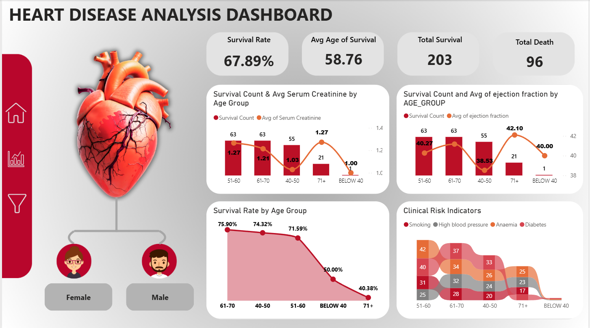
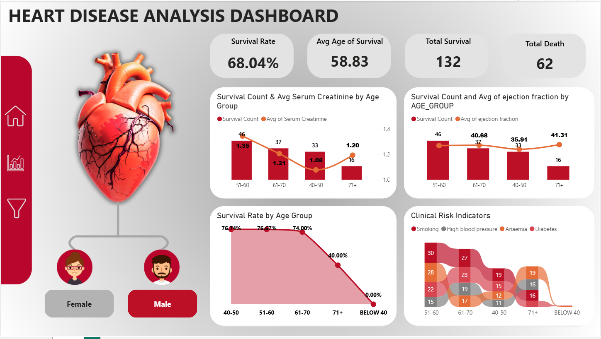
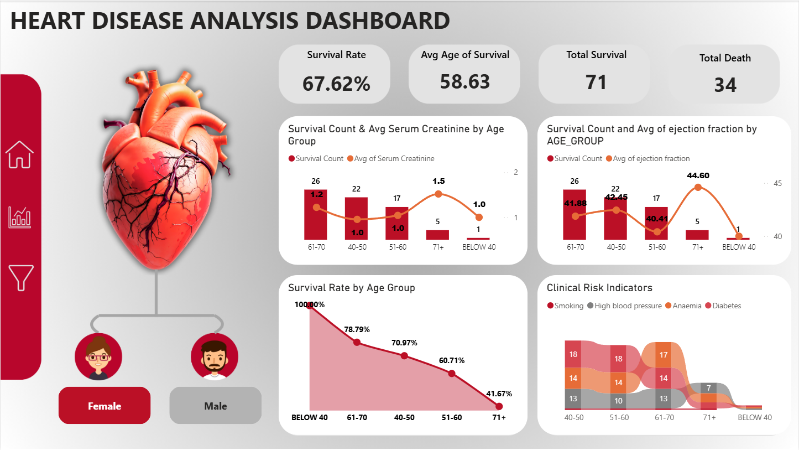
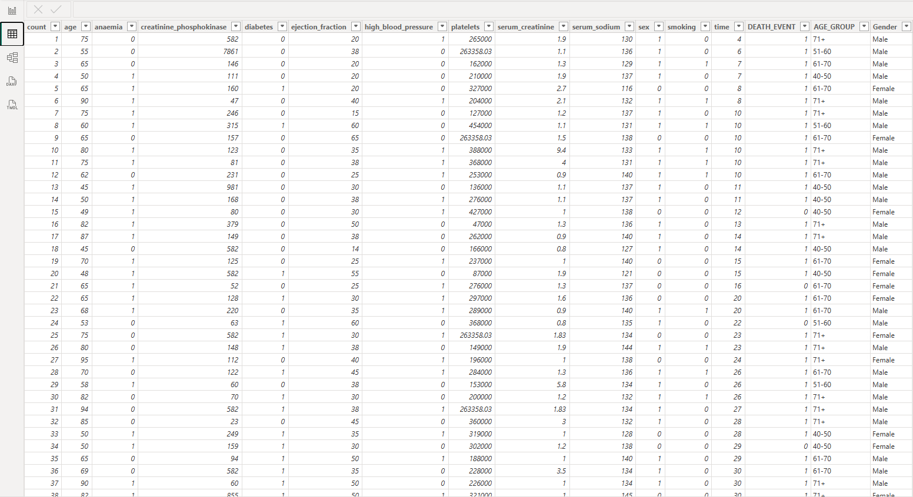

# ❤️ Heart Disease Analysis Dashboard — Power BI


> **A clinical heart failure analysis dashboard built in Power BI — analyzing survival rates, patient health trends, and risk factors across 299 heart failure patients using real medical data.**
> Features age-group segmentation, serum creatinine & ejection fraction trend analysis, clinical risk indicators (smoking, diabetes, anaemia, high blood pressure), and gender-based filtering.

---

## 📸 Dashboard Preview

| All Patients View | Male Patients Filtered |
|---|---|
|  |  |

| Female Patients Filtered | Raw Dataset |
|---|---|
|  |  |

---

## 📊 Key Metrics (Overall — 299 Patients)

| Metric | Value |
|--------|-------|
| **Survival Rate** | 67.89% |
| **Avg Age of Survival** | 58.76 years |
| **Total Survival** | 203 patients |
| **Total Death** | 96 patients |

**Male patients** (filtered): Survival Rate 68.04% · 132 survived · 62 deaths
**Female patients** (filtered): Survival Rate 67.62% · 71 survived · 34 deaths

---

## 🚀 What Makes This Project Stand Out

- ✅ **Clinical-grade metrics** — survival rate, avg age at survival, total survival vs death
- ✅ **Age group segmentation** — Below 40 / 40-50 / 51-60 / 61-70 / 71+
- ✅ **Dual-axis combo charts** — survival count (bars) + avg serum creatinine (line) per age group
- ✅ **Ejection fraction analysis** — heart pump efficiency vs survival count by age
- ✅ **Survival Rate trend line** — sharp decline with age, shaded area chart
- ✅ **Clinical Risk Indicators ribbon chart** — Smoking / High Blood Pressure / Anaemia / Diabetes by age
- ✅ **Gender slicer** — Female / Male toggle, all visuals filter dynamically
- ✅ **3D Heart anatomy illustration** — medical-themed dashboard background

---

## 📊 Dashboard Sections

### 🔢 Top KPI Cards
| Card | Value |
|------|-------|
| Survival Rate | 67.89% |
| Avg Age of Survival | 58.76 |
| Total Survival | 203 |
| Total Death | 96 |

### 📈 Chart 1 — Survival Count & Avg Serum Creatinine by Age Group
- **Type**: Line and Clustered Column Chart
- **X-axis**: Age Group (Below 40, 40-50, 51-60, 61-70, 71+)
- **Bars**: Survival Count per age group
- **Line**: Average Serum Creatinine (mg/dL) — orange smooth line with markers
- **Filter**: Only survivors (DEATH_EVENT = 0)
- **Key insight**: Serum creatinine spikes at 71+ (1.27) and Below 40 (1.00), with lowest at 40-50 (1.03)

| Age Group | Survival Count | Avg Serum Creatinine |
|-----------|---------------|---------------------|
| 51-60 | 63 | 1.27 |
| 61-70 | 63 | 1.21 |
| 40-50 | 55 | 1.03 |
| 71+ | 21 | 1.27 |
| Below 40 | 1 | 1.00 |

### 📈 Chart 2 — Survival Count & Avg Ejection Fraction by Age Group
- **Type**: Line and Clustered Column Chart
- **X-axis**: Age Group
- **Bars**: Survival Count
- **Line**: Average Ejection Fraction (%) — measures heart pump efficiency
- **Key insight**: Ejection fraction peaks at 71+ (42.10%), lowest at 51-60 (38.53%)

| Age Group | Survival Count | Avg Ejection Fraction |
|-----------|---------------|----------------------|
| 51-60 | 63 | 40.27% |
| 61-70 | 63 | 40.00% |
| 40-50 | 55 | 38.53% |
| 71+ | 21 | 42.10% |
| Below 40 | 1 | 40.00% |

### 📉 Chart 3 — Survival Rate by Age Group
- **Type**: Area line chart (shaded, red)
- **Key insight**: Survival rate declines sharply with age

| Age Group | Survival Rate |
|-----------|--------------|
| 61-70 | 75.90% (highest) |
| 40-50 | 74.32% |
| 51-60 | 71.59% |
| Below 40 | 50.00% |
| 71+ | 40.38% (lowest) |

> For **female patients**: Below 40 achieves **100%** survival rate; drops to 41.67% at 71+

### 🎗️ Chart 4 — Clinical Risk Indicators (Ribbon Chart)
- **Type**: Ribbon chart — shows relative weight of each risk factor by age group
- **Legend items**:
  - 🔴 Smoking (red)
  - ⚫ High Blood Pressure (grey)
  - 🟠 Anaemia (orange)
  - 🩷 Diabetes (pink/light)
- **Age groups on X-axis**: 51-60, 61-70, 40-50, 71+, Below 40

**Sample values (All patients)**:
| Age Group | Smoking | High BP | Anaemia | Diabetes |
|-----------|---------|---------|---------|----------|
| 51-60 | 42 | 37 | 25 | 31 |
| 61-70 | 34 | 33 | 26 | 32 |
| 40-50 | — | — | 24 | 28 |
| 71+ | 17 | 23 | 20 | — |

### 🔘 Gender Slicer
- **Female** / **Male** toggle buttons
- Rounded rectangle style, red when selected
- Filters ALL visuals simultaneously

---

## 🗂️ Dataset Structure (299 Patients — Single Flat Table)

| Column | Type | Description |
|--------|------|-------------|
| `count` | Integer | Record number |
| `age` | Integer | Patient age |
| `anaemia` | Binary (0/1) | Presence of anaemia |
| `creatinine_phosphokinase` | Integer | CPK enzyme level (mcg/L) |
| `diabetes` | Binary (0/1) | Diabetic patient |
| `ejection_fraction` | Integer | % blood pumped per heartbeat |
| `high_blood_pressure` | Binary (0/1) | Hypertension flag |
| `platelets` | Float | Platelets count (kiloplatelets/mL) |
| `serum_creatinine` | Float | Serum creatinine level (mg/dL) |
| `serum_sodium` | Integer | Serum sodium level (mEq/L) |
| `sex` | Binary (0=F, 1=M) | Patient sex |
| `smoking` | Binary (0/1) | Smoker flag |
| `time` | Integer | Follow-up period (days) |
| `DEATH_EVENT` | Binary (0=survived, 1=died) | Outcome |
| `AGE_GROUP` | Calculated | Below 40 / 40-50 / 51-60 / 61-70 / 71+ |
| `Gender` | Calculated | Female / Male (from sex column) |

**Source**: UCI Machine Learning Repository — Heart Failure Clinical Records Dataset

---

## ⚙️ Technical Implementation

### 🧮 DAX Measures

```dax
-- Survival Rate
Survival Rate =
1 - DIVIDE(
    SUM('HeartData'[DEATH_EVENT]),
    COUNT('HeartData'[count])
)

-- Average Age of Survival
Avg Age of Survival =
CALCULATE(
    AVERAGE('HeartData'[age]),
    'HeartData'[DEATH_EVENT] = 0
)

-- Total Survival
Total Survival =
CALCULATE(
    COUNT('HeartData'[count]),
    'HeartData'[DEATH_EVENT] = 0
)

-- Total Death
Total Death =
CALCULATE(
    COUNT('HeartData'[count]),
    'HeartData'[DEATH_EVENT] = 1
)
```

### 📐 Calculated Columns

```dax
-- Age Group (Switch/Case)
AGE_GROUP =
SWITCH(TRUE(),
    'HeartData'[age] >= 40 && 'HeartData'[age] <= 50, "40-50",
    'HeartData'[age] >= 51 && 'HeartData'[age] <= 60, "51-60",
    'HeartData'[age] >= 61 && 'HeartData'[age] <= 70, "61-70",
    'HeartData'[age] >= 71, "71+",
    "BELOW 40"
)

-- Gender Label
Gender =
IF('HeartData'[sex] = 0, "Female", "Male")
```

### 🎨 Design & Theme
- **Background**: Custom dark grey/charcoal medical-themed background image
- **Left panel**: Dark red sidebar with navigation icons (Home, Analytics, Filter)
- **3D Heart illustration**: Anatomically detailed heart graphic — left side focal point
- **Gender avatar icons**: Cartoon female/male avatars connected by lines
- **Color scheme**: Dark red (#8B0000) + crimson (#DC143C) + orange accents
- **Cards**: Light grey rounded rectangles, bold black numbers
- **Charts**: Red bars, orange smooth line with circular markers
- **Survival trend**: Red area chart with pink shading and percentage labels

---

## 🛠️ How to Use This Project

### Download & Explore
1. Download `HEART_DISEASE_ANALYSIS_DASHBOARD.pbix`
2. Open in **Power BI Desktop**
3. Use **Female / Male** slicer to filter all visuals by gender
4. Read each chart section by section — top KPIs → serum creatinine chart → ejection fraction → survival rate trend → clinical risk indicators

### Clinical Interpretation
- **Survival Rate drops with age** — 75.9% at 61-70 to 40.38% at 71+
- **Higher serum creatinine = worse outcomes** — kidney function is a key predictor
- **Lower ejection fraction = weaker heart** — 40-50 age group shows lowest ejection (38.53%)
- **Smoking and high BP dominate risk** at 51-60 age group
- **Female patients under 40 show 100% survival** in the filtered view

---

## 📌 Skills Demonstrated

| Skill | Application |
|-------|-------------|
| **Healthcare Analytics** | Clinical survival analysis, medical KPIs |
| **DAX Measures** | Survival rate formula, conditional CALCULATE, AVERAGE |
| **Calculated Columns** | Age group Switch/Case, Gender label from binary |
| **Combo Charts** | Line + clustered column with dual Y-axis |
| **Ribbon Chart** | Multi-variable risk factor visualization |
| **Area Chart** | Survival rate trend with shading |
| **Gender Slicer** | Dynamic filtering with styled toggle buttons |
| **Dashboard Design** | Medical theme, 3D illustration, dark sidebar |

---

## 🔧 Requirements

| Tool | Notes |
|------|-------|
| Power BI Desktop | Free download from Microsoft |
| Dataset Source | UCI Machine Learning Repository — Heart Failure Clinical Records |

---

## 👨‍💻 Author

**Saketh Suman Bathini**
Data Analyst · AI Engineer · Full-Stack Developer · Hyderabad, India

[](https://www.linkedin.com/in/saketh-suman/)
[](https://github.com/SakethSumanBathini)
[](mailto:sakethsumanbathini@gmail.com)

---

## 📄 License

This project is open source and available under the [MIT License](LICENSE).

---

> ⭐ **If this project helped you, please give it a star!**
